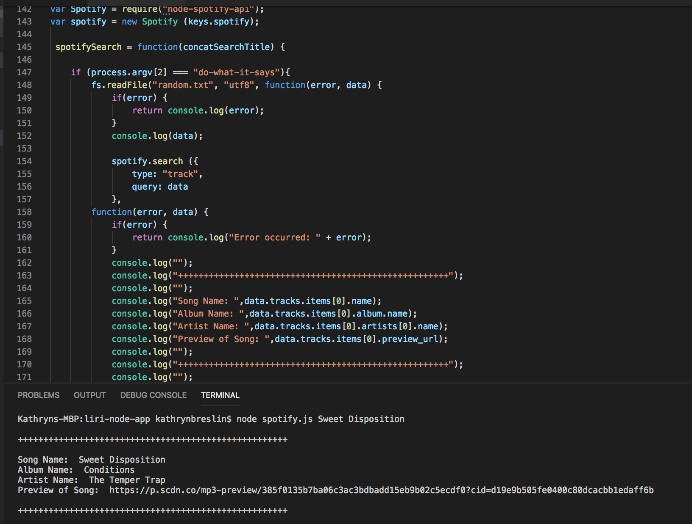
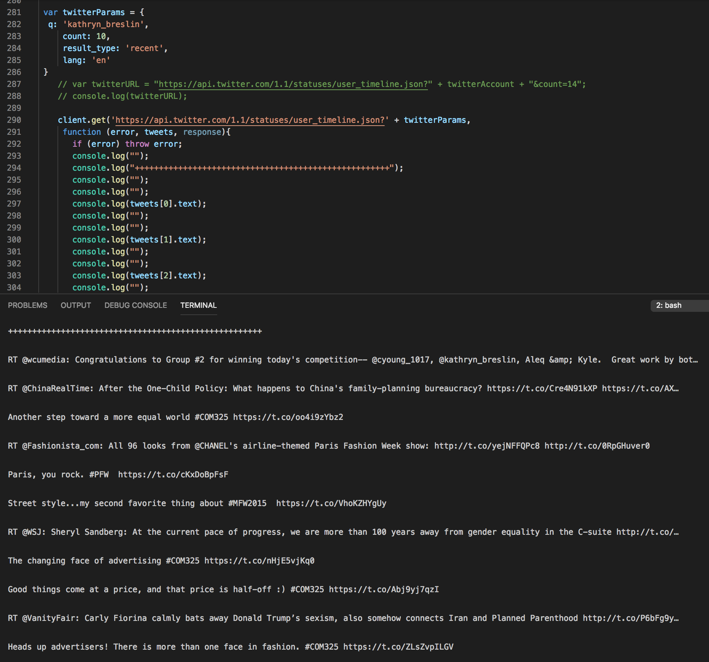
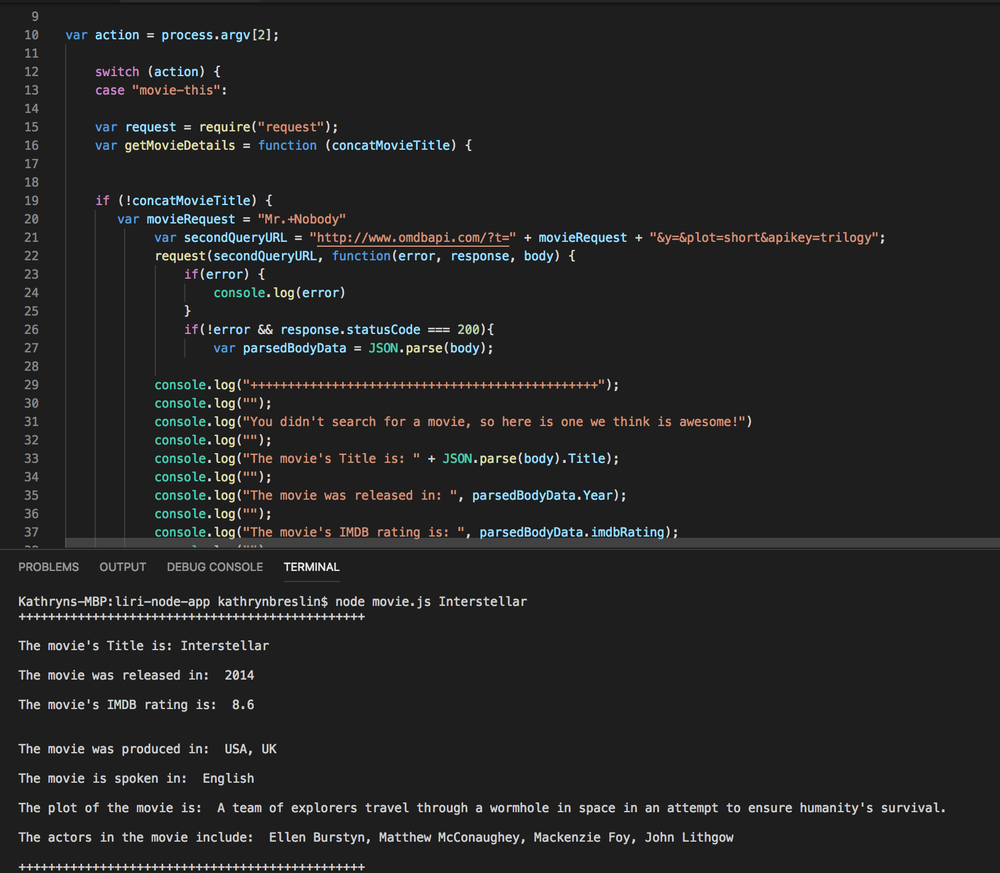

# LIRI Bot
#### A Language Interpretation and Recognition Interface

## Spotify

## Twitter

## OMDB

## About
LIRI is a Language Interpretation and Recognition Interface application. Similar to SIRI, it receives commnads from the user and responds with information reflecting the command. While SIRI is a vocal command application, LIRI is a command line node application that takes in parameters from the user.

LIRI pulls data from three (3) APIs: Twitter, Spotify and OMDB. 